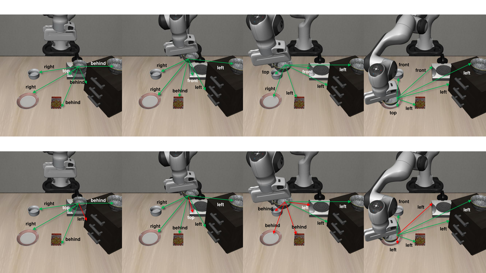
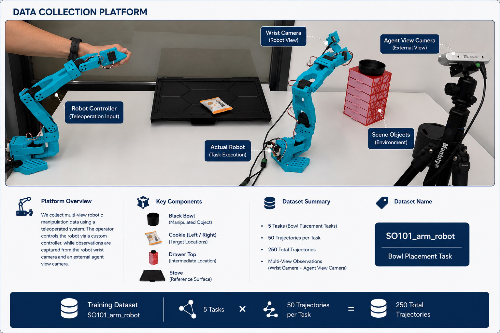

<div align="center">

# EmbodimentSemantic

### A Spatial Scene-Graph Dataset and Benchmark for Vision-Language Models on Embodied Manipulation Trajectories

**Hassan Jaber¹ · Refinath S N² · Luca Cagliero¹ · Christopher E. Mower² · Haitham Bou-Ammar²³**

¹Politecnico di Torino &nbsp;·&nbsp; ²Huawei Noah's Ark Lab &nbsp;·&nbsp; ³University College London

[](.)
[](.)
[](.)
[](vla_benchmarking/LICENSE)



</div>

---

## Overview

Spatial grounding remains a key limitation of vision–language–action (VLA) systems. EmbodimentSemantic provides a unified framework for diagnosing this gap: it evaluates whether VLMs can recover exact object–relation–object triplets from robot manipulation observations, and tests whether injecting those triplets into existing VLA policies improves downstream control.

The dataset has two components:

- **LIBERO benchmark** — 500 simulator demonstrations (62,250 paired timesteps, 124,500 RGB frames) across 10 LIBERO-Spatial tasks. Ground-truth scene graphs are derived automatically from MuJoCo geometry, world coordinates, and camera projections, giving exact triplet-level supervision without manual annotation.
- **SO101 real-robot dataset** — 50 teleoperated episodes across 5 tabletop bowl-placement tasks collected with the low-cost SO101 arm. Includes external-camera, wrist-camera, and depth streams in LeRobot format.



---

## Dataset Statistics

### LIBERO Simulator Benchmark

| Attribute | Value |
| --- | --- |
| Tasks | 10 |
| Demonstrations | 500 (50 per task) |
| Paired timesteps | 62,250 |
| Total RGB frames | 124,500 |
| Frames per demo | 75–197 (mean 124.5) |
| Cameras | 2 (`agentview`, `eye_in_hand`) |
| RGB resolution | 128 × 128 |
| Canonical objects | 7 |
| Directed relations | 8 |
| Mean triplets / frame (agentview) | 42.0 |
| Mean triplets / frame (eye_in_hand) | 16.73 |

### SO101 Real-Robot Dataset

| Attribute | Value |
| --- | --- |
| Tasks | 5 |
| Demonstrations | 257 (47–53 per task) |
| Total raw frames | 240,598 |
| Total sampled frames | 8,252 |
| Cameras | 2 (`agent_view`, `wrist`) |
| Frame rate | 30 FPS (sampled at ~1 fps, step 30) |
| Format | LeRobot |

### LIBERO-Spatial Tasks

| Task ID | Initial spatial context of `akita_black_bowl_1` |
|---|---|
| T0 | Between the plate and the ramekin |
| T1 | From table center |
| T2 | In the top drawer of the wooden cabinet |
| T3 | Next to the cookie box |
| T4 | Next to the plate |
| T5 | Next to the ramekin |
| T6 | On the cookie box |
| T7 | On the ramekin |
| T8 | On the stove |
| T9 | On the wooden cabinet |

### Object and Relation Ontology

| Type | Name | Description |
|---|---|---|
| Object | `akita_black_bowl_1` | Manipulated bowl |
| Object | `akita_black_bowl_2` | Distractor bowl |
| Object | `cookies_1` | Cookie box |
| Object | `glazed_rim_porcelain_ramekin_1` | Ramekin reference object |
| Object | `plate_1` | Target placement object |
| Object | `wooden_cabinet_1` | Cabinet / drawer |
| Object | `flat_stove_1` | Stove reference surface |
| Relation | `is_left_of` / `is_right_of` | Lateral world-frame ordering |
| Relation | `is_in_front_of` / `is_behind` | Depth world-frame ordering |
| Relation | `is_on_top_of` / `is_below_of` | Vertical support / stacking |
| Relation | `is_inside` / `contains` | Containment |

---

## Repository Structure

```
EmbodimentSemantic/
├── LIBERO_Semantic_Generation.ipynb   # Offline scene-graph annotation pipeline
├── vla_benchmarking/                  # Online VLA evaluation interface
│   ├── run_lerobot_eval_with_context.py # LeRobot policy evaluation entry point
│   ├── libero_live_semantic_context.py  # Live bounding-box and scene-graph computation
│   ├── radomize_scenes.py               # Object pose swaps + SceneRandomizerVecEnvWrapper
│   ├── randomize_scenes_demo.py         # Visualize scene swaps without a policy
│   ├── config.py                        # All settings and per-task swap configs
│   ├── bddl_utils.py                    # BDDL goal-condition helpers
│   ├── setup_env.py                     # One-shot environment setup script
│   ├── models.yaml                      # Catalogue of tested HuggingFace checkpoints
│   ├── requirements.txt                 # pip dependencies
│   └── swap_outputs/                    # Demo images written by randomize_scenes_demo.py
└── vlm_benchmarking/                  # Offline VLM benchmark
    ├── run.py                         # Inference entry point
    ├── evaluate.py                    # Standalone evaluation
    ├── evaluate_all.py                # Batch evaluation across models
    ├── config.yaml                    # Camera, frame, and object configuration
    ├── models.yaml                    # Catalogue of tested model IDs
    ├── vlm_bench/                     # Core benchmark library
    │   ├── runner.py                  # Inference pipeline
    │   ├── eval.py                    # Triplet-level evaluation metrics
    │   └── prompts.py                 # Camera-specific prompt templates
    ├── run_job.sh                     # SLURM inference job
    └── eval_job.sh                    # SLURM evaluation job
```

---

## VLM Benchmark

Evaluates whether VLMs can recover directed spatial scene graphs from robot camera observations. Models are prompted with the RGB frame, task description, object vocabulary, and fixed relation set. Predictions are scored at the exact triplet level against simulator-derived ground truth.

### Setup

```bash
cd vlm_benchmarking
python -m venv .venv
source .venv/bin/activate   # Windows: .venv\Scripts\activate

# API models (Gemini, OpenAI, Anthropic, NVIDIA)
pip install -r requirements-api.txt

# Local models via vLLM
pip install vllm
pip install -r requirements.txt

cp .env.example .env
# Fill in: GEMINI_API_KEY, OPENAI_API_KEY, ANTHROPIC_API_KEY, NVIDIA_API_KEY, HF_TOKEN
```

### Running Inference

```bash
# API model
python run.py --model gemini-3.1-pro-preview --type gemini --input-dir data/libero_spatial_v5/

# Local model (vLLM)
python run.py --model Qwen/Qwen2.5-VL-7B-Instruct --type vllm --name qwen2.5-7b \
    --input-dir data/libero_spatial_v5/

# Limit scope for testing
python run.py --model Qwen/Qwen2.5-VL-7B-Instruct --type vllm \
    --input-dir data/libero_spatial_v5/ --tasks 2 --demos 5 --frames 1

# SO101 real-robot dataset
python run.py --dataset-type so1001 --model gemini-3.1-pro-preview --type gemini \
    --input-dir data/SO1001_dataset/

# List all known model IDs
python run.py --list-models
```

**Supported backends:**

| `--type` | Description | Required env var |
|---|---|---|
| `vllm` | Local inference via vLLM | `HF_TOKEN` |
| `hf` | HuggingFace Transformers (fallback) | `HF_TOKEN` |
| `gemini` | Google Gemini API | `GEMINI_API_KEY` |
| `openai` | OpenAI API | `OPENAI_API_KEY` |
| `anthropic` | Anthropic Claude API | `ANTHROPIC_API_KEY` |
| `nvidia` | NVIDIA NIM API | `NVIDIA_API_KEY` |

### Evaluation

```bash
# Evaluate a model output folder
python evaluate.py --model-dir output/qwen2.5-7b/ --input-dir data/libero_spatial_v5/

# Compare two models
python evaluate.py --model-dir output/qwen2.5-7b/ output/gemini-3.1-pro-preview/ \
    --input-dir data/libero_spatial_v5/ --save-csv results/comparison.csv

# Unidirectional evaluation (collapse inverse pairs)
python evaluate.py --model-dir output/qwen2.5-7b/ --input-dir data/libero_spatial_v5/ --direction u
```

**Reported metrics:**

| Metric | Description |
|---|---|
| Mean per-task F1 | Main score — equal weight per task |
| Macro F1 | Mean of per-frame F1 scores |
| Micro F1 | Pooled TP/FP/FN across all frames |
| Per-relation F1 | Precision/recall/F1 per relation type |
| Coverage | Fraction of GT relation types present in predictions |
| Hallucination rate | FP / (TP + FP) |
| Direction consistency | Fraction of inverse pairs both predicted correctly |
| Per-object recall | Recall per object across all frames |

### Results

| Model | agentview mF1 | eye_in_hand mF1 |
|---|---|---|
| gemini-3.1-pro | **0.5674** | **0.3773** |
| InternVL3-78B | 0.3519 | 0.2101 |
| Qwen3-VL-8B-Instruct | 0.2877 | 0.2108 |
| InternVL3_5-14B | 0.2561 | 0.1265 |
| gemma-4-E4B-it | 0.2209 | 0.1472 |
| Molmo2-8B | 0.1888 | 0.1459 |
| InternVL3_5-8B | 0.1769 | 0.1465 |
| nemotron-nano-12b-v2-vl | 0.1599 | 0.1270 |
| Qwen2.5-VL-7B-Instruct | 0.1405 | 0.1147 |
| MomaGraph-R1 | 0.1023 | 0.0926 |

A key finding: models achieve high relation-type coverage (up to 0.98) but low exact triplet F1, revealing that current VLMs often produce plausible spatial predicates while failing to bind them to the correct ordered object pairs. Depth, support, and containment relations are systematically harder than lateral relations.

---

## VLA Benchmark

The VLA interface evaluates whether injecting live spatial scene graphs into existing fine-tuned policies improves downstream robot control — with no retraining or architecture changes. Two policies are tested: **Pi0** (`lerobot/pi0_libero_finetuned`) and **Pi05** (`lerobot/pi05_libero_finetuned`), both fine-tuned on LIBERO-Spatial. Each policy is evaluated under two prompt conditions:

- **`standard`** — original LIBERO task description only
- **`scene_graph`** — same description augmented with live object–relation–object triplets extracted from the current MuJoCo state, subject-filtered to `akita_black_bowl_1`

### Installation

Requires Python 3.12+, a CUDA GPU, and Git.

```bash
cd vla_benchmarking
conda create -n vla_bench python=3.12 -y
conda activate vla_bench
python setup_env.py   # clones LIBERO, installs lerobot[pi] + robosuite, runs smoke test
```

> **Windows:** Enable Developer Mode (Settings → System → For Developers) for HuggingFace symlinks, or run as Administrator.

### Running

Evaluation is controlled via environment variables from inside `vla_benchmarking/`.

**PowerShell:**

```powershell
$env:CONTEXT_MODE="scene_graph"; $env:TASK_IDS="[4]"; python run_lerobot_eval_with_context.py
```

**bash/zsh:**

```bash
CONTEXT_MODE=scene_graph TASK_IDS=[4] python run_lerobot_eval_with_context.py
```

| Variable | Default | Description |
| --- | --- | --- |
| `CONTEXT_MODE` | *(required)* | `standard`, `scene_graph`, `bounding_boxes`, `scene_graph_bounding_boxes` |
| `TASK_IDS` | `[0]` | Task indices, e.g. `[3]` or `[0,1,2]` |
| `MODELS` | `lerobot/pi0_libero_base` | HuggingFace policy checkpoint |
| `DEVICE` | `cuda` | `cuda` or `cpu` |
| `N_EPISODES` | `1` | Episodes per task |
| `SEED` | `1000` | Random seed |

**Visualize scene swaps without running a policy:**

```bash
python randomize_scenes_demo.py        # all tasks → swap_outputs/
python randomize_scenes_demo.py 3 7    # specific tasks only
```

### Scene Perturbations

Beyond the default LIBERO layouts, the benchmark applies four types of task-conditioned perturbations to test policy robustness:

**Object removal** — strips distractor objects from the scene before the env loads, testing whether policies rely on irrelevant context:

| Task | Removed objects |
| --- | --- |
| T4 | `cookies_1`, `glazed_rim_porcelain_ramekin_1` |
| T8 | `glazed_rim_porcelain_ramekin_1`, `cookies_1` |

**Prompt override** — replaces the task description string while keeping the same BDDL goal condition:

| Task | Override prompt |
| --- | --- |
| T0 | *"pick up the black bowl in front of the ramekin and place it on the plate"* |
| T7 | *"pick up the black bowl behind the wooden cabinet and place it on the plate"* |

**Camera override** — switches to out-of-distribution viewpoints to test visual robustness:

| Task | Cameras |
| --- | --- |
| T2 | `frontview`, `robot0_robotview` |
| T6 | `frontview`, `robot0_robotview` |

**Pose swaps and moves** — rearranges object positions before each episode reset, then settles physics with the robot frozen:

| Task | Operations |
| --- | --- |
| T1 | Swap `bowl_1`↔`bowl_2`, swap `ramekin`↔`cookies`, swap `cookies`↔`plate`, swap `bowl_1`↔`ramekin` |
| T3 | Swap `bowl_2`↔`plate`, swap `ramekin`↔`bowl_2` |
| T5 | Swap `cookies`↔`ramekin`, swap `bowl_1`↔`bowl_2`, move `bowl_1` by (0, 0, +0.05), move `plate` by (−0.05, −0.45, +0.5) |
| T9 | Swap `bowl_2`↔`plate`, swap `cookies`↔`bowl_2`, move `bowl_2` by (0, −0.1, 0) |

### VLA Results

Scene-graph injection improves several Pi05 tasks without any retraining. The largest gain is +30 pp on T4; T8 degrades by −20 pp, showing that relational context can interfere when it conflicts with the policy's learned prompt representation.

| Task | Pi0 std | Pi0 + sg | Δ | Pi05 std | Pi05 + sg | Δ |
| --- | --- | --- | --- | --- | --- | --- |
| T0 | 2.0% | 2.0% | +0.0 | 100.0% | 100.0% | +0.0 |
| T1 | 0.0% | 0.0% | +0.0 | 0.0% | 0.0% | +0.0 |
| T2 | 90.0% | **94.0%** | +4.0 | 0.0% | 0.0% | +0.0 |
| T3 | 0.0% | 0.0% | +0.0 | 0.0% | 0.0% | +0.0 |
| T4 | 0.0% | 0.0% | +0.0 | 46.0% | **76.0%** | **+30.0** |
| T5 | 0.0% | 0.0% | +0.0 | 0.0% | 2.0% | +2.0 |
| T6 | 90.0% | 90.0% | +0.0 | 0.0% | 0.0% | +0.0 |
| T7 | 0.0% | 0.0% | +0.0 | 8.0% | 16.0% | +8.0 |
| T8 | 0.0% | 0.0% | +0.0 | 44.0% | 24.0% | **−20.0** |
| T9 | 0.0% | 0.0% | +0.0 | 0.0% | 0.0% | +0.0 |

*std = standard prompt; sg = scene-graph-augmented prompt. Δ in percentage points over 50 episodes.*

---

## Offline Scene-Graph Generation

`LIBERO_Semantic_Generation.ipynb` documents the full pipeline for generating frame-level scene graphs from LIBERO HDF5 files. For each frame it:

1. Extracts MuJoCo object geometry (world position, rotation, half-sizes) and projects 8 bounding-box corners into camera views via the pinhole model.
2. Checks pairwise 2D bounding-box overlap to assign vertical (`is_on_top_of` / `is_below_of`) and containment (`is_inside` / `contains`) relations.
3. Falls back to dominant-axis world-frame ordering for lateral (`is_left_of` / `is_right_of`) and depth (`is_in_front_of` / `is_behind`) relations.
4. Writes annotations back to the HDF5 under `obs/agentview_scene_graph` and `obs/robot0_eye_in_hand_scene_graph`.

The live version of this pipeline (`vla_benchmarking/libero_live_semantic_context.py`) runs the same logic at policy evaluation time.
